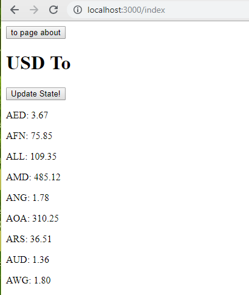
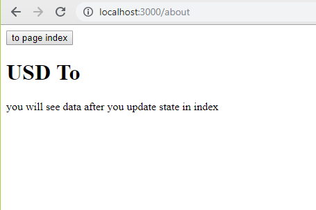
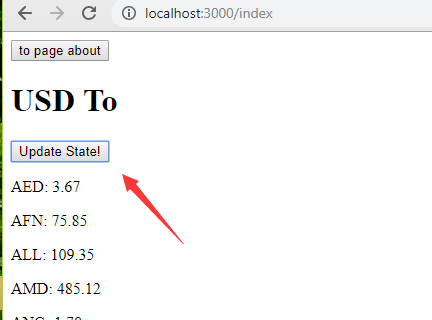
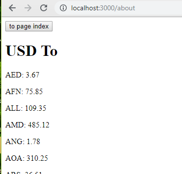

# Create-Next-Apollo

```
npm i -g create-next-apollo
create-next-apollo myAppName

or

npx create-next-apollo myAppName
```

## Instruction

It is ready to use, it comes with simple example that shows you:

1. How to use Unstated to share state across pages.
2. How to Apollo in Next
3. How to SSR Apollo in Next
4. How to environment variable (inject with env-cmd and get it from next.config.js)

Out of the box:

1. CSS import support
2. Image import support
3. Sass import support

What can you expect when you npm run dev?

  
The data is loaded together with the page which mean SSR is working.

  
You should see nothing in about page because you haven't updated the state in container.

  
Now go back and update the state in index page.

  
And now you should see the same data in About page.

## Troubleshooting

**ENOENT error when _npm i -g create-next-apollo_ in desktop folder**  
cause: unknown  
remedy: there is three workaround, **download and install new version of npm** or **npx create-next-apollo myAppName** or create a new folder and **run npm i -g create-next-apollo** in the folder

## Acknowledgement

Greatly Inspired by [Next Apollo Example](https://github.com/zeit/next.js/tree/canary/examples/with-apollo)

## Misc

Great library, deserve more attention [Unstated](https://github.com/jamiebuilds/unstated)

This project was bootstrapped with [Create NPM Create](https://www.npmjs.com/package/create-npm-create).
